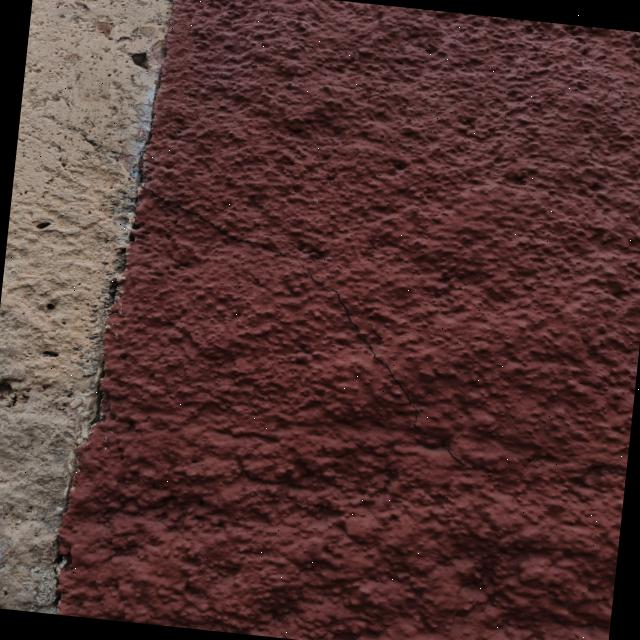

# 🏛️ HeritageCracks Dataset: Superficial Damage in Historical Monuments 🏛️

<div align="center">


-orange?style=for-the-badge)


</div>

## 📋 Table of Contents
- [Overview](#-overview)
- [Key Features](#-key-features)
- [Dataset Description](#-dataset-description)
- [Dataset Preprocessing & Augmentation](#-dataset-preprocessing--augmentation)
- [System Requirements](#-system-requirements)
- [Installation & Usage](#-installation--usage)
- [Usage Example](#-usage-example)
- [Supported Frameworks & Technologies](#-supported-frameworks--technologies)
- [Project Architecture](#-project-architecture)
- [Contribution Guidelines](#-contribution-guidelines)
- [Research Team](#-research-team)
- [Citation](#-citation)
- [License](#-license)

## 📌 Overview
The **HeritageCracks** dataset is a comprehensive collection of images designed to characterize superficial damage in historical monuments within the city of Morelia, primarily focusing on temples. This dataset enables the automated detection and classification of structural deterioration using computer vision and deep learning techniques, contributing to the preservation and structural health monitoring of cultural heritage.

<div align="center">
  
  <p><i>Example of superficial damage in a historical monument in Morelia.</i></p>
</div>

## ✨ Key Features
- **📸 High-Quality Imagery:** High-resolution images focused on capturing precise superficial damage on historical architecture.
- **🏛️ Real-World Scenarios:** Specifically targeted at temples and historical monuments in Morelia, capturing diverse textures, lighting, and degradation levels.
- **🧠 Ready for AI:** Fully annotated, preprocessed, and augmented to be directly used for training object detection and computer vision models (e.g., YOLO, ResNet).

## 📝 Dataset Description
This dataset is structured to facilitate the training and evaluation of machine learning models. The data distribution has been carefully divided to ensure optimal model performance:
- **75%** for Training 🏋️‍♂️
- **15%** for Validation 🔍
- **10%** for Testing 🧪

*Note: The total dataset size after augmentation is **1,716 images**.*

## 📊 Dataset Preprocessing & Augmentation
The dataset was carefully built using the following specifications to ensure robust model training and generalization:

- **Total Images:** 1,716
- **Classes:** 1 (Grietas / Damage)
- **Data Split:** 75% Training / 15% Validation / 10% Testing

### Preprocessing
- **Auto-Orient:** Applied (with EXIF-orientation stripping)
- **Resize:** Stretch to 640x640

### Augmentation
- **Flip:** Horizontal (50%), Vertical (50%)
- **90° Rotate:** Equal probability of none, Clockwise, Counter-Clockwise, Upside Down
- **Crop:** 0% Minimum Zoom, 20% Maximum Zoom
- **Rotation:** Between -9° and +9°
- **Saturation:** Between -25% and +25%
- **Noise:** Salt and pepper noise applied to 0.1% of pixels

## 💻 System Requirements

To train deep learning models using this dataset, the following system specifications are recommended:

| Component | Minimum | Recommended |
| :--- | :--- | :--- |
| **OS** | Windows 10 / Ubuntu 20.04 | Windows 11 / Ubuntu 22.04 |
| **CPU** | 4 Cores | 8+ Cores |
| **RAM** | 8 GB | 16 GB+ |
| **GPU** | NVIDIA GTX 1060 (6GB) | NVIDIA RTX 3060 (8GB+) or better |
| **Python** | 3.8+ | 3.10+ |

## 🛠️ Installation & Usage

### 📥 Downloading the Dataset
To download this dataset and use it in your local environment, clone this repository:

```bash
git clone https://github.com/yourusername/Heritage_cracks.git
cd Heritage_cracks
```

Install the necessary dependencies to use the dataset with YOLO:
```bash
pip install ultralytics opencv-python
```

## 🚀 Usage Example

This dataset is fully formatted in **YOLO format**. Below is a Python example showing how to train a YOLO model using the provided `data.yaml`:

```python
from ultralytics import YOLO

# Load a pre-trained YOLO model
model = YOLO('yolo11n.pt')  # You can choose yolo11s.pt, yolo11m.pt, etc.

# Train the model using the HeritageCracks dataset
results = model.train(
    data='CRACKS_PHONE.v2/data.yaml', 
    epochs=100, 
    imgsz=640, 
    batch=16,
    device=0 # Set to 'cpu' if no GPU is available
)

# Run inference on a test image
metrics = model.val()
print("Training and validation complete!")
```

## 📦 Supported Frameworks & Technologies

<div align="center">

| 📦 Framework | 🚀 Usage |
| :--- | :--- |
|  | **Object Detection:** This project is fully formatted, annotated, and **ready to be used directly in YOLO models** for training and inference. |
|  | **Deep Learning Training:** Compatible with PyTorch-based computer vision pipelines and custom model architectures. |
|  | **Programming Language:** Base language for scripts, data handling, and model execution. |
|  | **Dataset Management:** Used for annotations, preprocessing, and augmentations. |

</div>

## 📂 Project Architecture

```text
📦 Heritage_cracks/
├── 📁 CRACKS_PHONE.v2/           # Main dataset directory
│   ├── 📁 test/                  # Testing images and labels (10%)
│   ├── 📁 train/                 # Training images and labels (75%)
│   │   ├── 📁 images/            # Augmented training images
│   │   └── 📁 labels/            # Bounding box labels (YOLO format)
│   └── 📁 valid/                 # Validation images and labels (15%)
├── 📁 Images/                    # Repository images and assets
│   ├── 📄 EMAG.jpg               # Researcher photo
│   ├── 📄 JAGT1.jpg              # Researcher photo
│   └── 📄 Maybe.png              # Researcher photo
├── 📄 data.yaml                  # Dataset configuration file for YOLO
├── 📄 README.dataset.txt         # Dataset documentation
├── 📄 README.roboflow.txt        # Roboflow export information
└── 📄 README.md                  # Project documentation (This file)
```

## 🤝 Contribution Guidelines
We welcome contributions to improve the **HeritageCracks** dataset! If you'd like to contribute:
1. **Fork** the repository.
2. **Create a new branch** (`git checkout -b feature/NewData`).
3. **Commit your changes** (`git commit -m 'Add new images of temple X'`).
4. **Push to the branch** (`git push origin feature/NewData`).
5. **Open a Pull Request**.

For major changes or additions to the dataset, please open an issue first to discuss what you would like to change.

## 🧑‍🔬 Research Team

### 🌟 Meet the Team
Researchers advancing civil engineering, computer vision, and the preservation of historical heritage.

<table align="center">
  <thead>
    <tr>
      <th align="center" width="120">Photo</th>
      <th align="left">Researcher</th>
      <th align="left">Affiliation</th>
      <th align="left">Contact</th>
    </tr>
  </thead>
  <tbody>
    <tr>
      <td align="center" width="120">
        
      </td>
      <td>
        <b>Maybeline Carolina García Chiquito</b> 🇲🇽<br/>
        <sub>PhD Student in Civil Engineering</sub>
      </td>
      <td>
        <a href="http://www.umich.mx"></a>
      </td>
      <td>
        <a href="mailto:maybelin.garcia@umich.mx"></a><br/>
        <a href="https://orcid.org/0009-0000-1793-4908"></a><br/>
        <a href="https://www.researchgate.net/profile/Maybelin-Garcia-Chiquito"></a>
      </td>
    </tr>
    <tr>
      <td align="center" width="120">
        
      </td>
      <td>
        <b>Dr. José Alberto Guzmán Torres</b> 🇲🇽<br/>
        <sub>Engineering Applications &amp; Artificial Intelligence</sub>
      </td>
      <td>
        <a href="http://www.siiia.com.mx"></a><br/>
        <a href="http://www.umich.mx"></a>
      </td>
      <td>
        <a href="mailto:jose.alberto.guzman@umich.mx"></a><br/>
        <a href="https://orcid.org/0000-0002-9309-9390"></a><br/>
        <a href="https://www.researchgate.net/profile/Jose-Guzman-Torres"></a>
      </td>
    </tr>
    <tr>
      <td align="center" width="120">
        
      </td>
      <td>
        <b>Dra. Elia Mercedes Alonso Guzmán</b> 🇲🇽<br/>
        <sub>Civil Engineering &amp; Materials Science</sub>
      </td>
      <td>
        <a href="http://www.umich.mx"></a>
      </td>
      <td>
        <a href="mailto:elia.alonso@umich.mx"></a><br/>
        <a href="https://orcid.org/0000-0002-8502-4313"></a><br/>
        <a href="https://www.researchgate.net/profile/Elia-Alonso-Guzman"></a>
      </td>
    </tr>
  </tbody>
</table>

## 🏆 Citation

If you use this dataset in your research or project, please cite the following repository/work:

```bibtex
@dataset{heritage_cracks_2026,
  author       = {García-Chiquito, Maybeline C. and Guzmán-Torres, José A. and Alonso-Guzmán, Elia M.},
  title        = {HeritageCracks Dataset: Superficial Damage in Historical Monuments},
  year         = {2026},
  publisher    = {Universidad Michoacana de San Nicolás de Hidalgo},
  howpublished = {\url{https://github.com/yourusername/Heritage_cracks}}
}
```

## ⚖️ License
This dataset is released under the **CC BY 4.0** (Creative Commons Attribution 4.0 International) License. You are free to use, modify, and distribute it, but please credit the authors appropriately.
